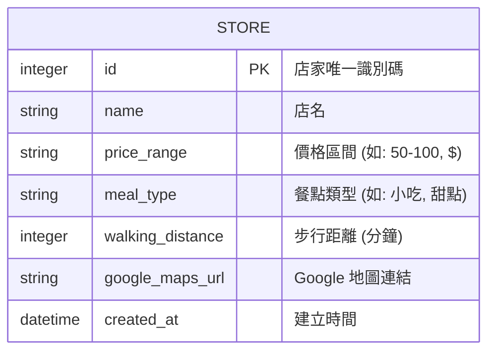

# 資料庫設計文件 (DB Design)

本文件定義了「逢甲美食大轉盤」使用的 SQLite 資料庫結構。

## 1. 實體關係圖 (ER Diagram)

## 2. 資料表說明

### 2.1 資料表名稱：`stores`

負責儲存逢甲商圈的美食店家資訊，包含預算、類型與地圖資訊。

| 欄位名稱 | 資料型別 | 屬性 | 說明 |
| :--- | :--- | :--- | :--- |
| `id` | INTEGER | PRIMARY KEY, AUTOINCREMENT | 店家資料的唯一識別碼 |
| `name` | TEXT | NOT NULL | 逢甲店家名稱 |
| `price_range` | TEXT | NULLABLE | 店家的價格區間（供轉盤條件篩選） |
| `meal_type` | TEXT | NULLABLE | 餐點的分類標籤（如：主食、點心） |
| `walking_distance` | INTEGER | NULLABLE | 距離使用者的步行時間（單位：分鐘） |
| `google_maps_url` | TEXT | NULLABLE | Google Maps 店家資訊連結 |
| `created_at` | DATETIME | DEFAULT CURRENT_TIMESTAMP | 該筆紀錄建立的時間點 |

